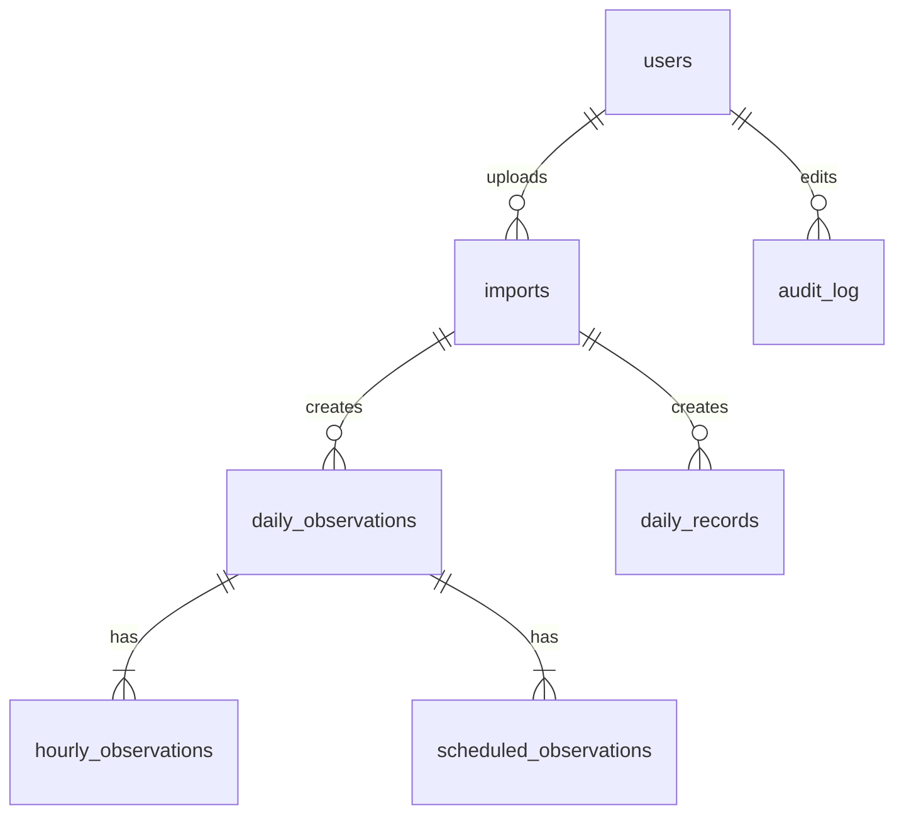

# Database schema

Draft for [#3](https://github.com/Code-4-Community/bho/issues/3). PostgreSQL on AWS RDS.

Sources:

- **Daily sheet**: [DAILY - 07. July2026.xlsx](https://docs.google.com/spreadsheets/d/1cWloMpYHZDGkUFulmeW0g1bY3J97Ts4b/edit), tab `Sheet1`. One 60-row block per day. Cell references are for the July 1 block; add 60 rows for each later day.
- **Historical sheet**: [BHO_WeatherRecords_Master_TestData.xlsx](https://docs.google.com/spreadsheets/d/1WI8CxTJ7edRajo3JHZX0WmTklvCqRy5x/edit), tab `All Daily Records`, rows 4-369.

Column names are camelCase to match the repo's TypeORM naming strategy, which uses property names as column names.

## Relations

`daily_records` joins to observations on month and day, not a foreign key.

## users

The scaffold's existing `User` entity, unchanged: `id`, `status`, `firstName`, `lastName`, `email`.

## imports

Source: the app, one row per uploaded spreadsheet.

| Column     | Type        | Null | Note                                 |
| ---------- | ----------- | ---- | ------------------------------------ |
| id         | serial      | N    | PK                                   |
| fileName   | text        | N    |                                      |
| s3Key      | text        | N    | Key of the uploaded file in S3       |
| uploadedBy | int         | N    | FK users                             |
| uploadedAt | timestamptz | N    | Defaults to now                      |
| status     | enum        | N    | `succeeded` or `failed`              |
| errors     | jsonb       | Y    | Flagged rows and the reason for each |

## daily_observations

Source: daily sheet, "Summary of Day" and nearby rows. PK `date`.

| Column               | Type       | Null | Source                                      |
| -------------------- | ---------- | ---- | ------------------------------------------- |
| date                 | date       | N    | J1 "Wednesday, July 1, 2026"                |
| maxTempF             | smallint   | Y    | A44 "24HR Max"                              |
| minTempF             | smallint   | Y    | B44 "24HR Min"                              |
| precipIn             | numeric    | Y    | C44 "24HR Precip"                           |
| precipTrace          | boolean    | N    | Our flag for when C44 is `T` (July 5: C284) |
| snowfallIn           | numeric    | Y    | E44 "Snowfall"                              |
| snowDepthIn          | numeric    | Y    | F44 "Dpth 0700"                             |
| sunshineMin          | smallint   | Y    | G44 "Total Min."                            |
| sunshinePct          | smallint   | Y    | H44 "% poss." (0.77 becomes 77)             |
| fastestMileMph       | smallint   | Y    | I44                                         |
| fastestMileDir       | varchar(3) | Y    | J44                                         |
| fastestMileTime      | time       | Y    | K44 "0245E" (24-hour, EST)                  |
| peakGustKts          | smallint   | Y    | L44 "20 WSW @ 0854E" (knots)                |
| peakGustDir          | varchar(3) | Y    | L44                                         |
| peakGustTime         | time       | Y    | L44                                         |
| avgStationPressureMb | numeric    | Y    | E56 "Station Pressure" AVG                  |
| sunrise              | time       | Y    | K29                                         |
| sunset               | time       | Y    | K30                                         |
| observerInitials     | text       | Y    | H59 "MFD/AKJ"                               |
| remarks              | text       | Y    | G47-G49 "Additional Notes"                  |
| import               | int        | Y    | FK imports                                  |

Not stored: average temperature, normal, departure, and degree days (rows 46-50). They can be computed.

## hourly_observations

Source: daily sheet, rows 4-27 ("00-01" to "23-24"). PK `(date, hour)`. Deleting a day deletes its hours.

| Column         | Type       | Null | Source                              |
| -------------- | ---------- | ---- | ----------------------------------- |
| date           | date       | N    | FK daily_observations               |
| hour           | smallint   | N    | A, start hour ("00-01" is 0)        |
| tempF          | smallint   | Y    | B "Temp (°F)"                       |
| precipIn       | numeric    | Y    | C "Precip"                          |
| precipTrace    | boolean    | N    | Our flag for when C is `T`          |
| windDir        | varchar(3) | Y    | D "Dir."                            |
| windSpeedMph   | smallint   | Y    | E "Spd (mph)"                       |
| sunshineMin    | smallint   | Y    | F "Sunshine (min)"                  |
| skyCover       | smallint   | Y    | G "Sky Cover (0-8)"                 |
| visibilityMi   | numeric    | Y    | H "Lwst VSBL" ("1/8" becomes 0.125) |
| presentWeather | text       | Y    | I "Prsnt WX" ("R-F")                |
| humidityPct    | smallint   | Y    | J "Rel Hum."                        |
| mountainVis    | text       | Y    | K "Mnts VSBL" ("1@1.5")             |
| remarks        | text       | Y    | L "Notes"                           |

## scheduled_observations

Source: daily sheet, "Scheduled Observations", rows 34-38. PK `(date, obsTime)`. Deleting a day deletes its readings.

| Column            | Type     | Null | Source                             |
| ----------------- | -------- | ---- | ---------------------------------- |
| date              | date     | N    | FK daily_observations              |
| obsTime           | time     | N    | A (700, 800, 1000, 1300, 1900)     |
| stationPressureIn | numeric  | Y    | B, 0700 and 1900 only              |
| dryBulbF          | numeric  | Y    | C                                  |
| wetBulbF          | numeric  | Y    | D                                  |
| dewpointF         | smallint | Y    | E                                  |
| humidityPct       | smallint | Y    | F (0.8 becomes 80)                 |
| maxTempF          | smallint | Y    | G, 0700 only, 24 hours ending 0700 |
| minTempF          | smallint | Y    | H, 0700 only                       |
| precipIn          | numeric  | Y    | I, 0700 only                       |
| precipTrace       | boolean  | N    | Our flag for when I is `T`         |
| snowfallIn        | numeric  | Y    | J, 0700 only                       |
| snowDepthIn       | numeric  | Y    | K, 0700 only                       |
| vaporPressureMb   | numeric  | Y    | L                                  |

## daily_records

Source: historical sheet. One sheet row becomes one row. PK `(month, day)`. Each element's value is null when the sheet says "None", and its years are null too.

| Column              | Type       | Null | Source                                             |
| ------------------- | ---------- | ---- | -------------------------------------------------- |
| month               | smallint   | N    | "Month #"                                          |
| day                 | smallint   | N    | "Day"                                              |
| highF               | smallint   | Y    | "High °F"                                          |
| highYears           | smallint[] | Y    | "High Year(s)"; "2014, 1977" becomes `{2014,1977}` |
| lowF                | smallint   | Y    | "Low °F"                                           |
| lowYears            | smallint[] | Y    | "Low Year(s)"                                      |
| precipIn            | numeric    | Y    | "Precip in"                                        |
| precipYears         | smallint[] | Y    | "Precip Year(s)"                                   |
| snowIn              | numeric    | Y    | "Snow in"; null for "None"                         |
| snowYears           | smallint[] | Y    | "Snow Year(s)"; null when snow is "None"           |
| peakGustMph         | smallint   | Y    | "Peak Gust mph"                                    |
| peakGustDir         | varchar(3) | Y    | "Wind Dir"                                         |
| peakGustIsEstimated | boolean    | N    | "Estimated?"                                       |
| peakGustYears       | smallint[] | Y    | "Gust Year(s)"                                     |
| import              | int        | Y    | FK imports                                         |

## audit_log

Source: the app, one row per edited value.

| Column     | Type        | Null | Note                 |
| ---------- | ----------- | ---- | -------------------- |
| id         | serial      | N    | PK                   |
| tableName  | text        | N    |                      |
| rowKey     | jsonb       | N    | PK of the edited row |
| columnName | text        | N    |                      |
| oldValue   | text        | Y    |                      |
| newValue   | text        | Y    |                      |
| changedBy  | int         | N    | FK users             |
| changedAt  | timestamptz | N    | Defaults to now      |

## Not in this draft

- `normals`: no normals data yet.
- `narratives`: no current source.
- `live_readings`, `ingestion_runs`: waiting on the WeatherLink API format.
