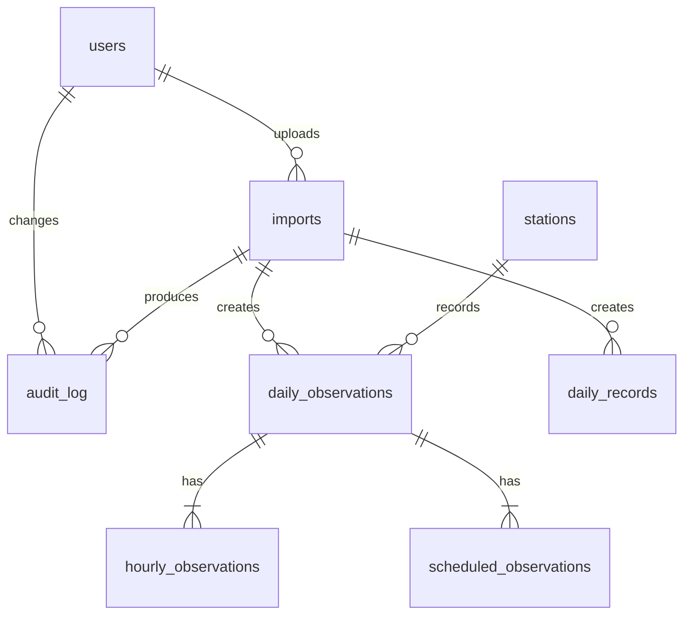

# Database schema

Draft for [#3](https://github.com/Code-4-Community/bho/issues/3). PostgreSQL on AWS RDS.

Sources:

- **Daily sheet**: [DAILY - 07. July2026.xlsx](https://docs.google.com/spreadsheets/d/1cWloMpYHZDGkUFulmeW0g1bY3J97Ts4b/edit), tab `Sheet1`. One 60-row block per day. Cell references are for the July 1 block; add 60 rows for each later day.
- **Historical sheet**: [BHO_WeatherRecords_Master_TestData.xlsx](https://docs.google.com/spreadsheets/d/1WI8CxTJ7edRajo3JHZX0WmTklvCqRy5x/edit), tab `All Daily Records`, rows 4-369.

Column names are camelCase to match the repo's TypeORM naming strategy, which uses property names as column names.

## Relations

`daily_records` joins to observations on month and day, not a foreign key.

## users

The scaffold's existing `User` entity, unchanged: `id`, `status`, `firstName`, `lastName`, `email`.

## stations

Source: the app. Starts with one row, `19737-02`; the client plans to add more. A table rather than an enum, so a new station is a new row, not a migration.

| Column | Type   | Null | Note               |
| ------ | ------ | ---- | ------------------ |
| id     | serial | N    | PK                 |
| code   | text   | N    | Unique, `19737-02` |

## imports

Source: the app, one row per uploaded spreadsheet. The uploaded file stays in S3 as the raw source of truth.

| Column     | Type        | Null | Note                                            |
| ---------- | ----------- | ---- | ----------------------------------------------- |
| id         | serial      | N    | PK                                              |
| kind       | text        | N    | `daily` or `historical`                         |
| fileName   | text        | N    |                                                 |
| s3Key      | text        | N    | Key of the uploaded file in S3                  |
| fileHash   | text        | N    | SHA-256 of the file, to catch duplicate uploads |
| uploadedBy | int         | N    | FK users                                        |
| uploadedAt | timestamptz | N    | Defaults to now                                 |
| status     | enum        | N    | `succeeded` or `failed`                         |
| errors     | jsonb       | Y    | Flagged rows and the reason for each            |

Ideas for later:

- `rowCount` (rows imported): not sure what the existing parser looks like
- `partial`? Do we want to allow for this, feels simpler to force a re-import and log that import failed

## daily_observations

Source: daily sheet, "Summary of Day" and nearby rows. PK `(stationId, date)`.

| Column               | Type       | Null | Source                                      |
| -------------------- | ---------- | ---- | ------------------------------------------- |
| stationId            | int        | N    | FK stations; the station the upload is for  |
| date                 | date       | N    | J1 "Wednesday, July 1, 2026"                |
| maxTempF             | smallint   | Y    | A44 "24HR Max"                              |
| minTempF             | smallint   | Y    | B44 "24HR Min"                              |
| precipIn             | numeric    | Y    | C44 "24HR Precip"                           |
| precipTrace          | boolean    | N    | Our flag for when C44 is `T` (July 5: C284) |
| snowfallIn           | numeric    | Y    | E44 "Snowfall"                              |
| snowDepthIn          | numeric    | Y    | F44 "Dpth 0700"                             |
| sunshineMin          | smallint   | Y    | G44 "Total Min."                            |
| sunshinePossibleMin  | smallint   | Y    | F29 "Poss 914" (possible sunshine minutes)  |
| sunshinePct          | smallint   | Y    | H44 "% poss." (0.77 becomes 77)             |
| fastestMileMph       | smallint   | Y    | I44                                         |
| fastestMileDir       | varchar(3) | Y    | J44                                         |
| fastestMileTime      | time       | Y    | K44 "0245E" (24-hour, EST)                  |
| peakGustKts          | smallint   | Y    | L44 "20 WSW @ 0854E" (knots)                |
| peakGustDir          | varchar(3) | Y    | L44                                         |
| peakGustTime         | time       | Y    | L44                                         |
| avgStationPressureMb | numeric    | Y    | E56 "Station Pressure" AVG                  |
| sunrise              | time       | Y    | K29                                         |
| sunset               | time       | Y    | K30                                         |
| observerInitials     | text       | Y    | H59 "MFD/AKJ"                               |
| remarks              | text       | Y    | G47-G49 "Additional Notes"                  |
| importId             | int        | N    | FK imports; the last upload that wrote it   |

Every row comes from an upload. Staff re-upload the month's sheet several times a day, and the most recent upload overwrites each day it contains. Weather values are nullable: an empty cell means no data and is stored as null, never 0. The same applies to `daily_records`.

Not stored: average temperature, normal, departure, and degree days (rows 46-50). They can be computed.

## hourly_observations

Source: daily sheet, rows 4-27 ("00-01" to "23-24"). PK `(stationId, date, hour)`. Deleting a day deletes its hours.

| Column         | Type       | Null | Source                                  |
| -------------- | ---------- | ---- | --------------------------------------- |
| stationId      | int        | N    | FK daily_observations, with `date`      |
| date           | date       | N    | FK daily_observations, with `stationId` |
| hour           | smallint   | N    | A, start hour ("00-01" is 0)            |
| tempF          | smallint   | Y    | B "Temp (°F)"                           |
| precipIn       | numeric    | Y    | C "Precip"                              |
| precipTrace    | boolean    | N    | Our flag for when C is `T`              |
| windDir        | varchar(3) | Y    | D "Dir."                                |
| windSpeedMph   | smallint   | Y    | E "Spd (mph)"                           |
| sunshineMin    | smallint   | Y    | F "Sunshine (min)"                      |
| skyCover       | smallint   | Y    | G "Sky Cover (0-8)"                     |
| visibilityMi   | numeric    | Y    | H "Lwst VSBL" ("1/8" becomes 0.125)     |
| presentWeather | text       | Y    | I "Prsnt WX" ("R-F")                    |
| humidityPct    | smallint   | Y    | J "Rel Hum."                            |
| mountainVis    | text       | Y    | K "Mnts VSBL" ("1@1.5")                 |
| remarks        | text       | Y    | L "Notes"                               |

## scheduled_observations

Source: daily sheet, "Scheduled Observations", rows 34-38. PK `(stationId, date, obsTime)`. Deleting a day deletes its readings.

| Column            | Type     | Null | Source                                  |
| ----------------- | -------- | ---- | --------------------------------------- |
| stationId         | int      | N    | FK daily_observations, with `date`      |
| date              | date     | N    | FK daily_observations, with `stationId` |
| obsTime           | time     | N    | A (700, 800, 1000, 1300, 1900)          |
| stationPressureIn | numeric  | Y    | B, 0700 and 1900 only                   |
| dryBulbF          | numeric  | Y    | C                                       |
| wetBulbF          | numeric  | Y    | D                                       |
| dewpointF         | smallint | Y    | E                                       |
| humidityPct       | smallint | Y    | F (0.8 becomes 80)                      |
| maxTempF          | smallint | Y    | G, 0700 only, 24 hours ending 0700      |
| minTempF          | smallint | Y    | H, 0700 only                            |
| precipIn          | numeric  | Y    | I, 0700 only                            |
| precipTrace       | boolean  | N    | Our flag for when I is `T`              |
| snowfallIn        | numeric  | Y    | J, 0700 only                            |
| snowDepthIn       | numeric  | Y    | K, 0700 only                            |
| vaporPressureMb   | numeric  | Y    | L                                       |

## daily_records

Source: historical sheet. One sheet row becomes one row. PK `(month, day)`. Each element's value is null when the sheet says "None", and its years are null too. No `stationId`: these are the records for the one official dataset.

| Column              | Type       | Null | Source                                             |
| ------------------- | ---------- | ---- | -------------------------------------------------- |
| month               | smallint   | N    | "Month #"                                          |
| day                 | smallint   | N    | "Day"                                              |
| highF               | smallint   | Y    | "High °F"                                          |
| highYears           | smallint[] | Y    | "High Year(s)"; "2014, 1977" becomes `{2014,1977}` |
| lowF                | smallint   | Y    | "Low °F"                                           |
| lowYears            | smallint[] | Y    | "Low Year(s)"                                      |
| precipIn            | numeric    | Y    | "Precip in"                                        |
| precipYears         | smallint[] | Y    | "Precip Year(s)"                                   |
| snowIn              | numeric    | Y    | "Snow in"; null for "None"                         |
| snowYears           | smallint[] | Y    | "Snow Year(s)"; null when snow is "None"           |
| peakGustMph         | smallint   | Y    | "Peak Gust mph"                                    |
| peakGustDir         | varchar(3) | Y    | "Wind Dir"                                         |
| peakGustIsEstimated | boolean    | N    | "Estimated?"                                       |
| peakGustYears       | smallint[] | Y    | "Gust Year(s)"                                     |
| importId            | int        | N    | FK imports; the last upload that wrote it          |

## audit_log

Source: a Postgres trigger, one row per inserted, updated, or deleted row in `daily_observations`, `hourly_observations`, `scheduled_observations`, and `daily_records`.

| Column    | Type        | Null | Note                                           |
| --------- | ----------- | ---- | ---------------------------------------------- |
| id        | serial      | N    | PK                                             |
| tableName | text        | N    |                                                |
| rowKey    | jsonb       | N    | PK of the affected row                         |
| action    | enum        | N    | `insert`, `update`, or `delete`                |
| oldData   | jsonb       | Y    | Whole row before; null on insert               |
| newData   | jsonb       | Y    | Whole row after; null on delete                |
| changedBy | int         | Y    | FK users; null for system writes               |
| importId  | int         | Y    | FK imports; set when an import made the change |
| changedAt | timestamptz | N    | Defaults to now                                |

One SQL function is attached to the four data tables, so no code path can skip the log.
